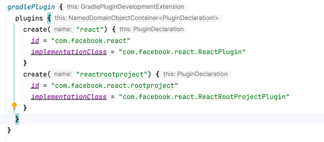
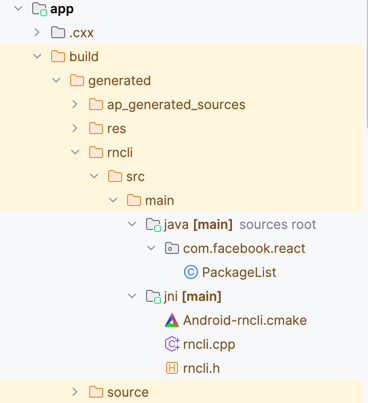
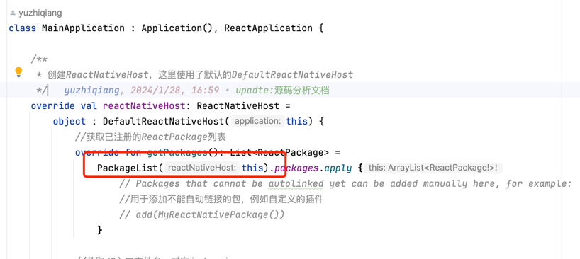

# @react-native/gradle-plugin

[![Version][version-badge]][package]

A Gradle Plugin used to support development of React Native applications for Android.

## Installation

```
yarn add @react-native/gradle-plugin
```

*Note: We're using `yarn` to install deps. Feel free to change commands to use `npm` 3+ and `npx` if you like*

[version-badge]: https://img.shields.io/npm/v/@react-native/gradle-plugin?style=flat-square
[package]: https://www.npmjs.com/package/@react-native/gradle-plugin

## Testing

To run the tests in this package, run the following commands from the React Native root folder:

1. `yarn` to install the dependencies. You just need to run this once
2. `yarn jest packages/react-native-gradle-plugin`.


### react-native-gradle-plugin 分析

我们先来分析一下`react-native-gradle-plugin`这个插件,这个插件是RN项目的核心插件，它的作用是管理RN项目的依赖和配置。



通过源码配置可以看到，一共提供了两个插件

- com.facebook.react
- com.facebook.react.rootproject

#### com.facebook.react.rootproject

我们先来看看 **com.facebook.react.rootproject**
该插件在项目的根目录下的build.gradle文件中被应用了

```groovy


/**
 * 该插件应用于`android/build.gradle`文件。
 * 该插件的作用是确保app项目在库项目之前被配置，以便在库项目被配置时可以使用app项目的配置
 *
 * @constructor
 */
class ReactRootProjectPlugin : Plugin<Project> {
    override fun apply(project: Project) {
        project.subprojects {
            // As the :app project (i.e. ReactPlugin) configures both namespaces and JVM toolchains
            // for libraries, its evaluation must happen before the libraries' evaluation.
            // Eventually the configuration of namespace/JVM toolchain can be moved inside this plugin.
            if (it.path != ":app") {
                it.evaluationDependsOn(":app")
            }
        }
    }
}

  ```

代码非常少，其作用就是是确保app项目在库项目之前被配置，以便在库项目被配置时可以使用app项目的配置。
简单说就是app中会有一个rn相关的配置，一些三方库中也会用到相关的配置，需要确保app项目的配置在库项目之前被配置以便于正常使用。

#### com.facebook.react

该插件是在app项目的build.gradle文件中被应用了
这个插件的代码相对多一些，我们来一点一点的分析

```Kotlin
    override fun apply(project: Project) {
        //检查JVM版本，不能低于17
        checkJvmVersion(project)
        //创建react配置
        val extension = project.extensions.create("react", ReactExtension::class.java, project)

        // We register a private extension on the rootProject so that project wide configs
        // like codegen config can be propagated from app project to libraries.
        /**
         * 在根项目创建一个私有的配置项 privateReact，如果已经存在则获取
         * 用于在app项目和库项目之间共享配置
         */
        val rootExtension =
            project.rootProject.extensions.findByType(PrivateReactExtension::class.java)
                ?: project.rootProject.extensions.create(
                    "privateReact", PrivateReactExtension::class.java, project
                )

        // App Only Configuration
        /**
         * 如果项目中使用了com.android.application插件，也就是app模块中会执行以下代码
         */
        project.pluginManager.withPlugin("com.android.application") {
            // We wire the root extension with the values coming from the app (either user populated or
            // defaults).

            /**
             * 下面代码实际上就是把用户自定义的配置赋值给rootExtension，就是把用户自定义的配置传递给上面创建好的一个私有配置项 privateReact
             */
            rootExtension.root.set(extension.root)
            rootExtension.reactNativeDir.set(extension.reactNativeDir)
            rootExtension.codegenDir.set(extension.codegenDir)
            rootExtension.nodeExecutableAndArgs.set(extension.nodeExecutableAndArgs)

            println("rootExtension root: ${rootExtension.root.get()}")
            println("rootExtension reactNativeDir: ${rootExtension.reactNativeDir.get()}")
            println("rootExtension codegenDir: ${rootExtension.codegenDir.get()}")
            println("rootExtension nodeExecutableAndArgs: ${rootExtension.nodeExecutableAndArgs.get()}")


            /**
             * 项目配置完成后，执行以下代码
             */
            project.afterEvaluate {
                val reactNativeDir = extension.reactNativeDir.get().asFile
                val propertiesFile = File(reactNativeDir, "ReactAndroid/gradle.properties")

                //获取版本号和groupName
                val versionAndGroupStrings = readVersionAndGroupStrings(propertiesFile)
                val versionString = versionAndGroupStrings.first
                val groupString = versionAndGroupStrings.second
                //配置依赖，主要是做了依赖替换和统一版本的逻辑
                configureDependencies(project, versionString, groupString)
                //配置仓库
                configureRepositories(project, reactNativeDir)
            }

            //配置NDK
            configureReactNativeNdk(project, extension)
            //配置App的构建配置字段
            configureBuildConfigFieldsForApp(project, extension)
            //配置开发端口 默认8081
            configureDevPorts(project)
            //处理老版本配置兼容性
            configureBackwardCompatibilityReactMap(project)
            //配置Java工具链，确保项目中的 Java 和 Kotlin 代码使用 Java 17 版本
            configureJavaToolChains(project)

            //根据不同的构建类型配置不同的任务
            project.extensions.getByType(AndroidComponentsExtension::class.java).apply {
                onVariants(selector().all()) { variant ->
                    //配置react任务，用于执行react-native的打包操作
                    project.configureReactTasks(variant = variant, config = extension)
                }
            }
            //配置react-native-codegen，用于生成所需代码
            configureCodegen(project, extension, rootExtension, isLibrary = false)
        }

        // Library Only Configuration
        configureBuildConfigFieldsForLibraries(project)
        configureNamespaceForLibraries(project)
        project.pluginManager.withPlugin("com.android.library") {
            configureCodegen(project, extension, rootExtension, isLibrary = true)
        }
    }

```

插件主要有以下逻辑

1. 检查JVM版本，不能低于17

```Kotlin
    private fun checkJvmVersion(project: Project) {
        val jvmVersion = Jvm.current()?.javaVersion?.majorVersion
        println("jvmVersion: $jvmVersion")
        if ((jvmVersion?.toIntOrNull() ?: 0) <= 16) {
            project.logger.error(
                """

      ********************************************************************************

      ERROR: requires JDK17 or higher.
      Incompatible major version detected: '$jvmVersion'

      ********************************************************************************

      """
                    .trimIndent()
            )
            exitProcess(1)
        }
    }
```

2. 创建react配置

```Kotlin
    val extension = project.extensions.create("react", ReactExtension::class.java, project)
```

3. 在根项目创建一个私有的配置项 privateReact，如果已经存在则获取，用于在app项目和库项目之间共享配置

```Kotlin
    val rootExtension =
            project.rootProject.extensions.findByType(PrivateReactExtension::class.java)
                ?: project.rootProject.extensions.create(
                    "privateReact", PrivateReactExtension::class.java, project
                )
```

PrivateReactExtension的代码如下

```Kotlin

abstract class PrivateReactExtension @Inject constructor(project: Project) {

    private val objects = project.objects

    /**
     * 创建一个根目录的属性
     * 最终的值根据项目名称决定
     * 如果项目名称为"react-native-github"或"react-native-build-from-source"，则目录为"../../"
     * 如果项目名称为其他，则目录为"../"
     */
    val root: DirectoryProperty = objects.directoryProperty().convention(
      
        if (project.rootProject.name == "react-native-github" || project.rootProject.name == "react-native-build-from-source") {
            project.rootProject.layout.projectDirectory.dir("../../")
        } else {
            project.rootProject.layout.projectDirectory.dir("../")
        }
    )

    /**
     * reactNativeDir的默认值为"node_modules/react-native"
     */
    val reactNativeDir: DirectoryProperty =
        objects.directoryProperty().convention(root.dir("node_modules/react-native"))

    /**
     * 指定 Node.js 可执行文件及其运行时参数，默认就是node，一般不会改
     */
    val nodeExecutableAndArgs: ListProperty<String> =
        objects.listProperty(String::class.java).convention(listOf("node"))

    /**
     * 生成代码的目录
     */
    val codegenDir: DirectoryProperty =
        objects.directoryProperty().convention(root.dir("node_modules/@react-native/codegen"))
}

```

4. 如果项目中使用了com.android.application插件，也就是app模块中会执行以下代码
    - 用户自定义的配置赋值给rootExtension，就是把用户自定义的配置传递给上面创建好的一个私有配置项 privateReact
    ```Kotlin
    project.pluginManager.withPlugin("com.android.application") {
        // We wire the root extension with the values coming from the app (either user populated or
        // defaults).
        rootExtension.root.set(extension.root)
        rootExtension.reactNativeDir.set(extension.reactNativeDir)
        rootExtension.codegenDir.set(extension.codegenDir)
        rootExtension.nodeExecutableAndArgs.set(extension.nodeExecutableAndArgs)
    }
    ```
    - 配置依赖，主要是做了依赖替换和统一版本的逻辑,这也就是为什么在app的build.gradle中的react
      native相关的依赖没有指定版本，实际上是在这里统一配置的

   ```Kotlin
    val reactNativeDir = extension.reactNativeDir.get().asFile
    val propertiesFile = File(reactNativeDir, "ReactAndroid/gradle.properties")

    //获取版本号和groupName
    val versionAndGroupStrings = readVersionAndGroupStrings(propertiesFile)
    val versionString = versionAndGroupStrings.first
    val groupString = versionAndGroupStrings.second
    //配置依赖，主要是做了依赖替换和统一版本的逻辑
    configureDependencies(project, versionString, groupString)
   ```
   readVersionAndGroupStrings方法，实际上就是从/node_modules/react-native/ReactAndroid/gradle.properties文件中读取版本号和group字符串
    ```Kotlin
    /**
     * 读取版本和group字符串
     * @param propertiesFile File
     * @return Pair<String, String>
     */
    fun readVersionAndGroupStrings(propertiesFile: File): Pair<String, String> {
        println("readVersionAndGroupStrings: $propertiesFile")
        val reactAndroidProperties = Properties()
        propertiesFile.inputStream().use { reactAndroidProperties.load(it) }
        val versionStringFromFile = reactAndroidProperties[INTERNAL_VERSION_NAME] as? String ?: ""
        // If on a nightly, we need to fetch the -SNAPSHOT artifact from Sonatype.
        val versionString =
            if (versionStringFromFile.startsWith("0.0.0") || "-nightly-" in versionStringFromFile) {
                "$versionStringFromFile-SNAPSHOT"
            } else {
                versionStringFromFile
            }
        // Returns Maven group for repos using different group for Maven artifacts
        val groupString =
            reactAndroidProperties[INTERNAL_PUBLISHING_GROUP] as? String
                ?: DEFAULT_INTERNAL_PUBLISHING_GROUP
        return Pair(versionString, groupString)
    }

    ```

   configureDependencies方法，主要做了依赖替换和统一版本的逻辑
    ```Kotlin
       /**
     * 配置依赖
     * 1.替换依赖
     * 2.强制使用指定版本
     *
     * @param project Project
     * @param versionString String
     * @param groupString String
     */
    fun configureDependencies(
        project: Project,
        versionString: String,
        groupString: String = DEFAULT_INTERNAL_PUBLISHING_GROUP
    ) {
        println("configureDependencies: $versionString, $groupString")
        if (versionString.isBlank()) return
        //遍历所有项目
        project.rootProject.allprojects { eachProject ->
            println("eachProject: ${eachProject.name}")
            //遍历项目的所有配置
            eachProject.configurations.all { configuration ->
                /**
                 * configuration.resolutionStrategy 用于配置解析策略，一般用于配置依赖替换和强制使用指定版本
                 */
                configuration.resolutionStrategy.dependencySubstitution {
                    //获取依赖替换列表
                    getDependencySubstitutions(
                        versionString,
                        groupString
                    ).forEach { (module, dest, reason) ->
                        //将指定的依赖替换为目标依赖
                        it.substitute(it.module(module)).using(it.module(dest)).because(reason)
                    }
                }
                //强制使用指定版本
                configuration.resolutionStrategy.force(
                    "${groupString}:react-android:${versionString}",
                    "${groupString}:flipper-integration:${versionString}",
                )

                //如果用户没有选择使用夜间版本进行本地开发，则强制使用hermes-android指定版本
                if (!(eachProject.findProperty(INTERNAL_USE_HERMES_NIGHTLY) as? String).toBoolean()) {
                    // Contributors only: The hermes-engine version is forced only if the user has
                    // not opted into using nightlies for local development.
                    configuration.resolutionStrategy.force("${groupString}:hermes-android:${versionString}")
                }
            }
        }
    }

    ```
   getDependencySubstitutions方法，主要是生成需要进行依赖替换的列表
    ```Kotlin
    /**
     * 生成依赖替换列表
     * @param versionString String
     * @param groupString String
     * @return List<Triple<String, String, String>>
     */
    internal fun getDependencySubstitutions(
        versionString: String,
        groupString: String = DEFAULT_INTERNAL_PUBLISHING_GROUP
    ): List<Triple<String, String, String>> {
        /**
         * 生成依赖替换列表
         * first:原始依赖
         * second:替换后的依赖
         * third:原因
         */
        val dependencySubstitution = mutableListOf<Triple<String, String, String>>()
        // react-native替换为react-android
        dependencySubstitution.add(
            Triple(
                "com.facebook.react:react-native",
                "${groupString}:react-android:${versionString}",
                "The react-native artifact was deprecated in favor of react-android due to https://github.com/facebook/react-native/issues/35210."
            )
        )
        // hermes-engine替换为hermes-android
        dependencySubstitution.add(
            Triple(
                "com.facebook.react:hermes-engine",
                "${groupString}:hermes-android:${versionString}",
                "The hermes-engine artifact was deprecated in favor of hermes-android due to https://github.com/facebook/react-native/issues/35210."
            )
        )
        // 如果 groupString 不是默认值 com.facebook.react，则修改react-android和hermes-android的Maven group
        if (groupString != DEFAULT_INTERNAL_PUBLISHING_GROUP) {
            dependencySubstitution.add(
                Triple(
                    "com.facebook.react:react-android",
                    "${groupString}:react-android:${versionString}",
                    "The react-android dependency was modified to use the correct Maven group."
                )
            )
            dependencySubstitution.add(
                Triple(
                    "com.facebook.react:hermes-android",
                    "${groupString}:hermes-android:${versionString}",
                    "The hermes-android dependency was modified to use the correct Maven group."
                )
            )
        }

        return dependencySubstitution
    }

    ```
    - 配置仓库源，这个比较简单，就是配置了一些依赖所需的仓库地址
    ```Kotlin
       fun configureRepositories(project: Project, reactNativeDir: File) {
        println("configureRepositories: $reactNativeDir")
        project.rootProject.allprojects { eachProject ->
            with(eachProject) {
                if (hasProperty(INTERNAL_REACT_NATIVE_MAVEN_LOCAL_REPO)) {
                    val mavenLocalRepoPath =
                        property(INTERNAL_REACT_NATIVE_MAVEN_LOCAL_REPO) as String
                    mavenRepoFromURI(File(mavenLocalRepoPath).toURI())
                }
                // We add the snapshot for users on nightlies.
                mavenRepoFromUrl("https://oss.sonatype.org/content/repositories/snapshots/")
                repositories.mavenCentral { repo ->
                    // We don't want to fetch JSC from Maven Central as there are older versions there.
                    repo.content { it.excludeModule("org.webkit", "android-jsc") }
                }
                // Android JSC is installed from npm
                mavenRepoFromURI(File(reactNativeDir, "../jsc-android/dist").toURI())
                repositories.google()
                mavenRepoFromUrl("https://www.jitpack.io")
            }
        }
    }
    ```
    - 配置NDK（Native Development Kit）相关设置
   ```Kotlin
    fun configureReactNativeNdk(project: Project, extension: ReactExtension) {
        project.pluginManager.withPlugin("com.android.application") {
            project.extensions.getByType(AndroidComponentsExtension::class.java)
                .finalizeDsl { ext ->
                    //是否启用新架构 没有直接返回
                    if (!project.isNewArchEnabled(extension)) {
                        // For Old Arch, we don't need to setup the NDK
                        return@finalizeDsl
                    }
                    // We enable prefab so users can consume .so/headers from ReactAndroid and hermes-engine
                    // .aar
                    ext.buildFeatures.prefab = true

                    // If the user has not provided a CmakeLists.txt path, let's provide
                    // the default one from the framework
                    if (ext.externalNativeBuild.cmake.path == null) {
                        ext.externalNativeBuild.cmake.path = File(
                            extension.reactNativeDir.get().asFile,
                            "ReactAndroid/cmake-utils/default-app-setup/CMakeLists.txt"
                        )
                    }

                    // Parameters should be provided in an additive manner (do not override what
                    // the user provided, but allow for sensible defaults).
                    val cmakeArgs = ext.defaultConfig.externalNativeBuild.cmake.arguments
                    if (cmakeArgs.none { it.startsWith("-DPROJECT_BUILD_DIR") }) {
                        cmakeArgs.add("-DPROJECT_BUILD_DIR=${project.layout.buildDirectory.get().asFile}")
                    }
                    if (cmakeArgs.none { it.startsWith("-DREACT_ANDROID_DIR") }) {
                        cmakeArgs.add(
                            "-DREACT_ANDROID_DIR=${
                                extension.reactNativeDir.file("ReactAndroid").get().asFile
                            }"
                        )
                    }
                    if (cmakeArgs.none { it.startsWith("-DANDROID_STL") }) {
                        cmakeArgs.add("-DANDROID_STL=c++_shared")
                    }
                    // Due to the new NDK toolchain file, the C++ flags gets overridden between compilation
                    // units. This is causing some libraries to don't be compiled with -DANDROID and other
                    // crucial flags. This can be revisited once we bump to NDK 25/26
                    if (cmakeArgs.none { it.startsWith("-DANDROID_USE_LEGACY_TOOLCHAIN_FILE") }) {
                        cmakeArgs.add("-DANDROID_USE_LEGACY_TOOLCHAIN_FILE=ON")
                    }

                    val architectures = project.getReactNativeArchitectures()
                    // abiFilters are split ABI are not compatible each other, so we set the abiFilters
                    // only if the user hasn't enabled the split abi feature.
                    if (architectures.isNotEmpty() && !ext.splits.abi.isEnable) {
                        ext.defaultConfig.ndk.abiFilters.addAll(architectures)
                    }
                }
        }
    }

   
   ```
    - 配置App的构建配置字段
    ```Kotlin
       /**
     * 确保在 Android 应用或库项目中启用buildConfig，并添加了两个自定义的布尔类型的构建配置字段，用于表示新架构是否启用以及是否启用了 Hermes 引擎。
     * 这些字段将在生成的 BuildConfig 类中作为静态字段提供。
     * @param project Project
     * @param extension ReactExtension
     */
    fun configureBuildConfigFieldsForApp(project: Project, extension: ReactExtension) {
        val action =
            Action<AppliedPlugin> {
                project.extensions.getByType(AndroidComponentsExtension::class.java)
                    .finalizeDsl { ext ->
                        ext.buildFeatures.buildConfig = true
                        ext.defaultConfig.buildConfigField(
                            "boolean",
                            "IS_NEW_ARCHITECTURE_ENABLED",
                            project.isNewArchEnabled(extension).toString()
                        )
                        ext.defaultConfig.buildConfigField(
                            "boolean", "IS_HERMES_ENABLED", project.isHermesEnabled.toString()
                        )
                    }
            }
        project.pluginManager.withPlugin("com.android.application", action)
        project.pluginManager.withPlugin("com.android.library", action)
    }

   ```
    - 配置开发端口 默认8081
   ```Kotlin
       fun configureDevPorts(project: Project) {
        val devServerPort =
            project.properties["reactNativeDevServerPort"]?.toString() ?: DEFAULT_DEV_SERVER_PORT
        val inspectorProxyPort =
            project.properties["reactNativeInspectorProxyPort"]?.toString() ?: devServerPort

        val action =
            Action<AppliedPlugin> {
                project.extensions.getByType(AndroidComponentsExtension::class.java)
                    .finalizeDsl { ext ->
                        ext.defaultConfig.resValue(
                            "integer",
                            "react_native_dev_server_port",
                            devServerPort
                        )
                        ext.defaultConfig.resValue(
                            "integer", "react_native_inspector_proxy_port", inspectorProxyPort
                        )
                    }
            }

        project.pluginManager.withPlugin("com.android.application", action)
        project.pluginManager.withPlugin("com.android.library", action)
    }

   
   ```

    - 处理老版本配置兼容性
    ```Kotlin
     fun configureBackwardCompatibilityReactMap(project: Project) {
    if (project.extensions.extraProperties.has("react")) {
      @Suppress("UNCHECKED_CAST")
      val reactMap =
          project.extensions.extraProperties.get("react") as? Map<String, Any?> ?: mapOf()
      if (reactMap.isNotEmpty()) {
        project.logger.error(
            """
          ********************************************************************************
 
          ERROR: Using old project.ext.react configuration. 
          We identified that your project is using a old configuration block as:
          
          project.ext.react = [
              // ...
          ]
          
          You should migrate to the new configuration:
          
          react {
              // ...
          }
          You can find documentation inside `android/app/build.gradle` on how to use it.
        
          ********************************************************************************
          """
                .trimIndent())
      }
    }

    // We set an empty react[] map so if a library is reading it, they will find empty values.
    project.extensions.extraProperties.set("react", mapOf<String, String>())
    }
   ```

    - 配置Java工具链，确保项目中的 Java 和 Kotlin 代码使用 Java 17 版本
    ```Kotlin
    fun configureJavaToolChains(input: Project) {
        // Check at the app level if react.internal.disableJavaVersionAlignment is set.
        if (input.hasProperty(INTERNAL_DISABLE_JAVA_VERSION_ALIGNMENT)) {
            return
        }
        input.rootProject.allprojects { project ->
            // Allows every single module to set react.internal.disableJavaVersionAlignment also.
            if (project.hasProperty(INTERNAL_DISABLE_JAVA_VERSION_ALIGNMENT)) {
                return@allprojects
            }
            val action =
                Action<AppliedPlugin> {
                    project.extensions.getByType(AndroidComponentsExtension::class.java)
                        .finalizeDsl { ext
                            ->
                            ext.compileOptions.sourceCompatibility = JavaVersion.VERSION_17
                            ext.compileOptions.targetCompatibility = JavaVersion.VERSION_17
                        }
                }
            project.pluginManager.withPlugin("com.android.application", action)
            project.pluginManager.withPlugin("com.android.library", action)
            project.pluginManager.withPlugin("org.jetbrains.kotlin.android") {
                project.extensions.getByType(KotlinTopLevelExtension::class.java).jvmToolchain(17)
            }
            project.pluginManager.withPlugin("org.jetbrains.kotlin.jvm") {
                project.extensions.getByType(KotlinTopLevelExtension::class.java).jvmToolchain(17)
            }
        }
    }
    ```
    - 根据不同的构建类型配置不同的任务
    ```Kotlin
            //根据不同的构建类型配置不同的任务
            project.extensions.getByType(AndroidComponentsExtension::class.java).apply {
                onVariants(selector().all()) { variant ->
                    //配置react任务，用于执行react-native的打包操作
                    project.configureReactTasks(variant = variant, config = extension)
                }
            }
    ``` 
   configureReactTasks 扩展方法
    ```Kotlin
   internal fun Project.configureReactTasks(variant: Variant, config: ReactExtension) {
    val targetName = variant.name.capitalizeCompat()
    val targetPath = variant.name

    val buildDir = this.layout.buildDirectory.get().asFile
    // Resources: generated/assets/react/<variant>/index.android.bundle
    val resourcesDir = File(buildDir, "generated/res/react/$targetPath")
    // Bundle: generated/assets/react/<variant>/index.android.bundle
    val jsBundleDir = File(buildDir, "generated/assets/react/$targetPath")
    // Sourcemap: generated/sourcemaps/react/<variant>/index.android.bundle.map
    val jsSourceMapsDir = File(buildDir, "generated/sourcemaps/react/$targetPath")
    // Intermediate packager:
    // intermediates/sourcemaps/react/<variant>/index.android.bundle.packager.map
    // Intermediate compiler:
    // intermediates/sourcemaps/react/<variant>/index.android.bundle.compiler.map
    val jsIntermediateSourceMapsDir = File(buildDir, "intermediates/sourcemaps/react/$targetPath")

    // The location of the cli.js file for React Native
    val cliFile = detectedCliFile(config)

    val isHermesEnabledInProject = project.isHermesEnabled
    val isHermesEnabledInThisVariant =
        if (config.enableHermesOnlyInVariants.get().isNotEmpty()) {
            config.enableHermesOnlyInVariants.get()
                .contains(variant.name) && isHermesEnabledInProject
        } else {
            isHermesEnabledInProject
        }
    val isDebuggableVariant =
        config.debuggableVariants.get().any { it.equals(variant.name, ignoreCase = true) }

    //配置新架构打包选项
    configureNewArchPackagingOptions(project, config, variant)
    //配置JS引擎打包选项
    configureJsEnginePackagingOptions(config, variant, isHermesEnabledInThisVariant)

    if (!isDebuggableVariant) {
        val entryFileEnvVariable = System.getenv("ENTRY_FILE")
        val bundleTask =
            tasks.register("createBundle${targetName}JsAndAssets", BundleHermesCTask::class.java) {
                it.root.set(config.root)
                it.nodeExecutableAndArgs.set(config.nodeExecutableAndArgs)
                it.cliFile.set(cliFile)
                it.bundleCommand.set(config.bundleCommand)
                it.entryFile.set(detectedEntryFile(config, entryFileEnvVariable))
                it.extraPackagerArgs.set(config.extraPackagerArgs)
                it.bundleConfig.set(config.bundleConfig)
                it.bundleAssetName.set(config.bundleAssetName)
                it.jsBundleDir.set(jsBundleDir)
                it.resourcesDir.set(resourcesDir)
                it.hermesEnabled.set(isHermesEnabledInThisVariant)
                it.minifyEnabled.set(!isHermesEnabledInThisVariant)
                it.devEnabled.set(false)
                it.jsIntermediateSourceMapsDir.set(jsIntermediateSourceMapsDir)
                it.jsSourceMapsDir.set(jsSourceMapsDir)
                it.hermesCommand.set(config.hermesCommand)
                it.hermesFlags.set(config.hermesFlags)
                it.reactNativeDir.set(config.reactNativeDir)
            }
        //将生成的资源目录添加到源集
        variant.sources.res?.addGeneratedSourceDirectory(
            bundleTask,
            BundleHermesCTask::resourcesDir
        )
        variant.sources.assets?.addGeneratedSourceDirectory(
            bundleTask,
            BundleHermesCTask::jsBundleDir
        )
        }
    }
    ```

    - 配置react-native-codegen，用于生成所需代码，帮助我们避免编写重复代码的工具。
5. 配置library项目的构建配置字段

```Kotlin
    /**
     * 配置构建配置字段
     * @param appProject Project
     */
    fun configureBuildConfigFieldsForLibraries(appProject: Project) {
        appProject.rootProject.allprojects { subproject ->
            subproject.pluginManager.withPlugin("com.android.library") {
                subproject.extensions.getByType(AndroidComponentsExtension::class.java)
                    .finalizeDsl { ext ->
                        ext.buildFeatures.buildConfig = true
                    }
            }
        }
    }

```

6. 配置library项目的namespace

```Kotlin
    fun configureNamespaceForLibraries(appProject: Project) {
        appProject.rootProject.allprojects { subproject ->
            subproject.pluginManager.withPlugin("com.android.library") {
                subproject.extensions.getByType(AndroidComponentsExtension::class.java)
                    .finalizeDsl { ext ->
                        if (ext.namespace == null) {
                            val android =
                                subproject.extensions.getByType(LibraryExtension::class.java)
                            val manifestFile = android.sourceSets.getByName("main").manifest.srcFile

                            manifestFile
                                .takeIf { it.exists() }
                                ?.let { file ->
                                    getPackageNameFromManifest(file)?.let { packageName ->
                                        ext.namespace = packageName
                                    }
                                }
                        }
                    }
            }
        }
    }
```

7. 如果项目中使用了com.android.library插件，也就是library模块中会执行以下代码
    - 配置react-native-codegen，用于生成所需代码，帮助我们避免编写重复代码的工具。

**总结**

到这里，我们大致清楚了`react-native-gradle-plugin`这个插件的主要作用如下

- 做了一些编译环境的检查
- 创建了一些配置项，用于在app项目和库项目之间共享配置
- 统一替换项目中的react-native相关的依赖，并确保版本一致
- 配置任务，包括打包，生成代码等

---

### native_modules.gradle 分析

下面再来看下`native_modules.gradle`这个脚本文件。这是一个源码形式的脚本文件，虽然只有一个文件，但是实际上要比插件的逻辑还要复杂一些，
源码如下

```groovy
import groovy.json.JsonSlurper
import org.gradle.initialization.DefaultSettings
import org.apache.tools.ant.taskdefs.condition.Os

def generatedFileName = "PackageList.java"
def generatedFilePackage = "com.facebook.react"
def generatedFileContentsTemplate = """
package $generatedFilePackage;

import android.app.Application;
import android.content.Context;
import android.content.res.Resources;

import com.facebook.react.ReactPackage;
import com.facebook.react.shell.MainPackageConfig;
import com.facebook.react.shell.MainReactPackage;
import java.util.Arrays;
import java.util.ArrayList;

{{ packageImports }}

public class PackageList {
  private Application application;
  private ReactNativeHost reactNativeHost;
  private MainPackageConfig mConfig;

  public PackageList(ReactNativeHost reactNativeHost) {
    this(reactNativeHost, null);
  }

  public PackageList(Application application) {
    this(application, null);
  }

  public PackageList(ReactNativeHost reactNativeHost, MainPackageConfig config) {
    this.reactNativeHost = reactNativeHost;
    mConfig = config;
  }

  public PackageList(Application application, MainPackageConfig config) {
    this.reactNativeHost = null;
    this.application = application;
    mConfig = config;
  }

  private ReactNativeHost getReactNativeHost() {
    return this.reactNativeHost;
  }

  private Resources getResources() {
    return this.getApplication().getResources();
  }

  private Application getApplication() {
    if (this.reactNativeHost == null) return this.application;
    return this.reactNativeHost.getApplication();
  }

  private Context getApplicationContext() {
    return this.getApplication().getApplicationContext();
  }

  public ArrayList<ReactPackage> getPackages() {
    return new ArrayList<>(Arrays.<ReactPackage>asList(
      new MainReactPackage(mConfig){{ packageClassInstances }}
    ));
  }
}
"""

def cmakeTemplate = """# This code was generated by [React Native CLI](https://www.npmjs.com/package/@react-native-community/cli)

cmake_minimum_required(VERSION 3.13)
set(CMAKE_VERBOSE_MAKEFILE on)

{{ libraryIncludes }}

set(AUTOLINKED_LIBRARIES
  {{ libraryModules }}
)
"""

def rncliCppTemplate = """/**
 * This code was generated by [React Native CLI](https://www.npmjs.com/package/@react-native-community/cli).
 *
 * Do not edit this file as changes may cause incorrect behavior and will be lost
 * once the code is regenerated.
 *
 */

#include "rncli.h"
{{ rncliCppIncludes }}

namespace facebook {
namespace react {

{{ rncliReactLegacyComponentNames }}

std::shared_ptr<TurboModule> rncli_ModuleProvider(const std::string moduleName, const JavaTurboModule::InitParams &params) {
{{ rncliCppModuleProviders }}
  return nullptr;
}

void rncli_registerProviders(std::shared_ptr<ComponentDescriptorProviderRegistry const> providerRegistry) {
{{ rncliCppComponentDescriptors }}
{{ rncliReactLegacyComponentDescriptors }}
  return;
}

} // namespace react
} // namespace facebook
"""

def rncliHTemplate = """/**
 * This code was generated by [React Native CLI](https://www.npmjs.com/package/@react-native-community/cli).
 *
 * Do not edit this file as changes may cause incorrect behavior and will be lost
 * once the code is regenerated.
 *
 */

#pragma once

#include <ReactCommon/JavaTurboModule.h>
#include <ReactCommon/TurboModule.h>
#include <jsi/jsi.h>
#include <react/renderer/componentregistry/ComponentDescriptorProviderRegistry.h>

namespace facebook {
namespace react {

std::shared_ptr<TurboModule> rncli_ModuleProvider(const std::string moduleName, const JavaTurboModule::InitParams &params);
void rncli_registerProviders(std::shared_ptr<ComponentDescriptorProviderRegistry const> providerRegistry);

} // namespace react
} // namespace facebook
"""

class ReactNativeModules {
  private Logger logger
  private String packageName
  private File root
  private ArrayList<HashMap<String, String>> reactNativeModules
  private ArrayList<String> unstable_reactLegacyComponentNames
  private HashMap<String, ArrayList> reactNativeModulesBuildVariants
  private String reactNativeVersion

  private static String LOG_PREFIX = ":ReactNative:"

  ReactNativeModules(Logger logger, File root) {
    this.logger = logger
    this.root = root

    def (nativeModules, reactNativeModulesBuildVariants, androidProject, reactNativeVersion) = this.getReactNativeConfig()
    this.reactNativeModules = nativeModules
    this.reactNativeModulesBuildVariants = reactNativeModulesBuildVariants
    this.packageName = androidProject["packageName"]
    this.unstable_reactLegacyComponentNames = androidProject["unstable_reactLegacyComponentNames"]
    this.reactNativeVersion = reactNativeVersion
  }

  /**
   * Include the react native modules android projects and specify their project directory
   */
  void addReactNativeModuleProjects(DefaultSettings defaultSettings) {
    reactNativeModules.forEach { reactNativeModule ->
      String nameCleansed = reactNativeModule["nameCleansed"]
      String androidSourceDir = reactNativeModule["androidSourceDir"]
      defaultSettings.include(":${nameCleansed}")
      defaultSettings.project(":${nameCleansed}").projectDir = new File("${androidSourceDir}")
    }
  }

  /**
   * Adds the react native modules as dependencies to the users `app` project
   */
  void addReactNativeModuleDependencies(Project appProject) {
    reactNativeModules.forEach { reactNativeModule ->
      def nameCleansed = reactNativeModule["nameCleansed"]
      def dependencyConfiguration = reactNativeModule["dependencyConfiguration"]
      appProject.dependencies {
        if (reactNativeModulesBuildVariants.containsKey(nameCleansed)) {
          reactNativeModulesBuildVariants
            .get(nameCleansed)
            .forEach { buildVariant ->
              if(dependencyConfiguration != null) {
                "${buildVariant}${dependencyConfiguration}"
              } else {
                "${buildVariant}Implementation" project(path: ":${nameCleansed}")
              }
            }
        } else {
          if(dependencyConfiguration != null) {
            "${dependencyConfiguration}"
          } else {
             implementation project(path: ":${nameCleansed}")
          }
        }
      }
    }
  }

  /**
   * Code-gen a java file with all the detected ReactNativePackage instances automatically added
   *
   * @param outputDir
   * @param generatedFileName
   * @param generatedFileContentsTemplate
   */
  void generatePackagesFile(File outputDir, String generatedFileName, String generatedFileContentsTemplate) {
    ArrayList<HashMap<String, String>> packages = this.reactNativeModules
    String packageName = this.packageName

    String packageImports = ""
    String packageClassInstances = ""

    if (packages.size() > 0) {
      def interpolateDynamicValues = {
        it
                // Before adding the package replacement mechanism,
                // BuildConfig and R classes were imported automatically
                // into the scope of the file. We want to replace all
                // non-FQDN references to those classes with the package name
                // of the MainApplication.
                //
                // We want to match "R" or "BuildConfig":
                //  - new Package(R.string…),
                //  - Module.configure(BuildConfig);
                //    ^ hence including (BuildConfig|R)
                // but we don't want to match "R":
                //  - new Package(getResources…),
                //  - new PackageR…,
                //  - new Royal…,
                //    ^ hence excluding \w before and after matches
                // and "BuildConfig" that has FQDN reference:
                //  - Module.configure(com.acme.BuildConfig);
                //    ^ hence excluding . before the match.
                .replaceAll(~/([^.\w])(BuildConfig|R)([^\w])/, {
                  wholeString, prefix, className, suffix ->
                    "${prefix}${packageName}.${className}${suffix}"
                })
      }
      packageImports = packages.collect {
        "// ${it.name}\n${interpolateDynamicValues(it.packageImportPath)}"
      }.join('\n')
      packageClassInstances = ",\n      " + packages.collect {
        interpolateDynamicValues(it.packageInstance)
      }.join(",\n      ")
    }

    String generatedFileContents = generatedFileContentsTemplate
      .replace("{{ packageImports }}", packageImports)
      .replace("{{ packageClassInstances }}", packageClassInstances)

    outputDir.mkdirs()
    final FileTreeBuilder treeBuilder = new FileTreeBuilder(outputDir)
    treeBuilder.file(generatedFileName).newWriter().withWriter { w ->
      w << generatedFileContents
    }
  }

  void generateCmakeFile(File outputDir, String generatedFileName, String generatedFileContentsTemplate) {
    ArrayList<HashMap<String, String>> packages = this.reactNativeModules
    String packageName = this.packageName
    String codegenLibPrefix = "react_codegen_"
    String libraryIncludes = ""
    String libraryModules = ""

    if (packages.size() > 0) {
      libraryIncludes = packages.collect {
        if (it.libraryName != null && it.cmakeListsPath != null) {
          // If user provided a custom cmakeListsPath, let's honor it.
          String nativeFolderPath = it.cmakeListsPath.replace("CMakeLists.txt", "")
          "add_subdirectory($nativeFolderPath ${it.libraryName}_autolinked_build)"
        } else {
          null
        }
      }.minus(null).join('\n')
      libraryModules = packages.collect {
        it.libraryName ? "${codegenLibPrefix}${it.libraryName}" : null
      }.minus(null).join('\n  ')
    }

    String generatedFileContents = generatedFileContentsTemplate
      .replace("{{ libraryIncludes }}", libraryIncludes)
      .replace("{{ libraryModules }}", libraryModules)

    outputDir.mkdirs()
    final FileTreeBuilder treeBuilder = new FileTreeBuilder(outputDir)
    treeBuilder.file(generatedFileName).newWriter().withWriter { w ->
      w << generatedFileContents
    }
  }

  void generateRncliCpp(File outputDir, String generatedFileName, String generatedFileContentsTemplate) {
    ArrayList<HashMap<String, String>> packages = this.reactNativeModules
    ArrayList<String> unstable_reactLegacyComponentNames = this.unstable_reactLegacyComponentNames
    String rncliCppIncludes = ""
    String rncliCppModuleProviders = ""
    String rncliCppComponentDescriptors = ""
    String rncliReactLegacyComponentDescriptors = ""
    String rncliReactLegacyComponentNames = ""
    String codegenComponentDescriptorsHeaderFile = "ComponentDescriptors.h"
    String codegenReactComponentsDir = "react/renderer/components"

    if (packages.size() > 0) {
      rncliCppIncludes = packages.collect {
        if (!it.libraryName) {
          return null
        }
        def result = "#include <${it.libraryName}.h>"
        if (it.componentDescriptors && it.componentDescriptors.size() > 0) {
          result += "\n#include <${codegenReactComponentsDir}/${it.libraryName}/${codegenComponentDescriptorsHeaderFile}>"
        }
        result
      }.minus(null).join('\n')
      rncliCppModuleProviders = packages.collect {
        it.libraryName ? """  auto module_${it.libraryName} = ${it.libraryName}_ModuleProvider(moduleName, params);
  if (module_${it.libraryName} != nullptr) {
    return module_${it.libraryName};
  }""" : null
      }.minus(null).join("\n")
      rncliCppComponentDescriptors = packages.collect {
        def result = ""
        if (it.componentDescriptors && it.componentDescriptors.size() > 0) {
          result += it.componentDescriptors.collect {
            "  providerRegistry->add(concreteComponentDescriptorProvider<${it}>());"
          }.join('\n')
        }
        result
      }.join("\n")
    }

    rncliReactLegacyComponentDescriptors = unstable_reactLegacyComponentNames.collect {
      "  providerRegistry->add(concreteComponentDescriptorProvider<UnstableLegacyViewManagerInteropComponentDescriptor<${it}>>());"
    }.join("\n")
    rncliReactLegacyComponentNames = unstable_reactLegacyComponentNames.collect {
      "extern const char ${it}[] = \"${it}\";"
    }.join("\n")
    if (unstable_reactLegacyComponentNames && unstable_reactLegacyComponentNames.size() > 0) {
      rncliCppIncludes += "\n#include <react/renderer/components/legacyviewmanagerinterop/UnstableLegacyViewManagerInteropComponentDescriptor.h>"
    }

    String generatedFileContents = generatedFileContentsTemplate
      .replace("{{ rncliCppIncludes }}", rncliCppIncludes)
      .replace("{{ rncliCppModuleProviders }}", rncliCppModuleProviders)
      .replace("{{ rncliCppComponentDescriptors }}", rncliCppComponentDescriptors)
      .replace("{{ rncliReactLegacyComponentDescriptors }}", rncliReactLegacyComponentDescriptors)
      .replace("{{ rncliReactLegacyComponentNames }}", rncliReactLegacyComponentNames)

    outputDir.mkdirs()
    final FileTreeBuilder treeBuilder = new FileTreeBuilder(outputDir)
    treeBuilder.file(generatedFileName).newWriter().withWriter { w ->
      w << generatedFileContents
    }
  }

  void generateRncliH(File outputDir, String generatedFileName, String generatedFileContentsTemplate) {
    String generatedFileContents = generatedFileContentsTemplate

    outputDir.mkdirs()
    final FileTreeBuilder treeBuilder = new FileTreeBuilder(outputDir)
    treeBuilder.file(generatedFileName).newWriter().withWriter { w ->
      w << generatedFileContents
    }
  }

  /**
   * Runs a specified command using Runtime exec() in a specified directory.
   * Throws when the command result is empty.
   */
  String getCommandOutput(String[] command, File directory) {
    try {
      def output = ""
      def cmdProcess = Runtime.getRuntime().exec(command, null, directory)
      def bufferedReader = new BufferedReader(new InputStreamReader(cmdProcess.getInputStream()))
      def buff = ""
      def readBuffer = new StringBuffer()
      while ((buff = bufferedReader.readLine()) != null) {
        readBuffer.append(buff)
      }
      output = readBuffer.toString()
      if (!output) {
        this.logger.error("${LOG_PREFIX}Unexpected empty result of running '${command}' command.")
        def bufferedErrorReader = new BufferedReader(new InputStreamReader(cmdProcess.getErrorStream()))
        def errBuff = ""
        def readErrorBuffer = new StringBuffer()
        while ((errBuff = bufferedErrorReader.readLine()) != null) {
          readErrorBuffer.append(errBuff)
        }
        throw new Exception(readErrorBuffer.toString())
      }
      return output
    } catch (Exception exception) {
      this.logger.error("${LOG_PREFIX}Running '${command}' command failed.")
      throw exception
    }
  }

  /**
   * Runs a process to call the React Native CLI Config command and parses the output
   */
  ArrayList<HashMap<String, String>> getReactNativeConfig() {
    if (this.reactNativeModules != null) return this.reactNativeModules

    ArrayList<HashMap<String, String>> reactNativeModules = new ArrayList<HashMap<String, String>>()
    HashMap<String, ArrayList> reactNativeModulesBuildVariants = new HashMap<String, ArrayList>()

    /**
     * Resolve the CLI location from Gradle file
     *
     * @todo: Sometimes Gradle can be called outside of the JavaScript hierarchy (-p flag) which
     * will fail to resolve the script and the dependencies. We should resolve this soon.
     *
     * @todo: `fastlane` has been reported to not work too.
     */
    def cliResolveScript = "try {console.log(require('@react-native-community/cli').bin);} catch (e) {console.log(require('react-native/cli').bin);}"
    String[] nodeCommand = ["node", "-e", cliResolveScript]
    def cliPath = this.getCommandOutput(nodeCommand, this.root)

    String[] reactNativeConfigCommand = ["node", cliPath, "config"]
    def reactNativeConfigOutput = this.getCommandOutput(reactNativeConfigCommand, this.root)

    def json
    try {
      json = new JsonSlurper().parseText(reactNativeConfigOutput)
    } catch (Exception exception) {
      throw new Exception("Calling `${reactNativeConfigCommand}` finished with an exception. Error message: ${exception.toString()}. Output: ${reactNativeConfigOutput}");
    }
    def dependencies = json["dependencies"]
    def project = json["project"]["android"]
    def reactNativeVersion = json["version"]

    if (project == null) {
      throw new Exception("React Native CLI failed to determine Android project configuration. This is likely due to misconfiguration. Config output:\n${json.toMapString()}")
    }

    def engine = new groovy.text.SimpleTemplateEngine()

    dependencies.each { name, value ->
      def platformsConfig = value["platforms"];
      def androidConfig = platformsConfig["android"]

      if (androidConfig != null && androidConfig["sourceDir"] != null) {
        this.logger.info("${LOG_PREFIX}Automatically adding native module '${name}'")

        HashMap reactNativeModuleConfig = new HashMap<String, String>()
        def nameCleansed = name.replaceAll('[~*!\'()]+', '_').replaceAll('^@([\\w-.]+)/', '$1_')
        reactNativeModuleConfig.put("name", name)
        reactNativeModuleConfig.put("nameCleansed", nameCleansed)
        reactNativeModuleConfig.put("androidSourceDir", androidConfig["sourceDir"])
        reactNativeModuleConfig.put("packageInstance", androidConfig["packageInstance"])
        reactNativeModuleConfig.put("packageImportPath", androidConfig["packageImportPath"])
        reactNativeModuleConfig.put("libraryName", androidConfig["libraryName"])
        reactNativeModuleConfig.put("componentDescriptors", androidConfig["componentDescriptors"])
        reactNativeModuleConfig.put("cmakeListsPath", androidConfig["cmakeListsPath"])

        if (androidConfig["buildTypes"] && !androidConfig["buildTypes"].isEmpty()) {
          reactNativeModulesBuildVariants.put(nameCleansed, androidConfig["buildTypes"])
        }
        if(androidConfig.containsKey("dependencyConfiguration")) {
          reactNativeModuleConfig.put("dependencyConfiguration", androidConfig["dependencyConfiguration"])
        } else if (project.containsKey("dependencyConfiguration")) {
          def bindings = ["dependencyName": nameCleansed]
          def template = engine.createTemplate(project["dependencyConfiguration"]).make(bindings)

          reactNativeModuleConfig.put("dependencyConfiguration", template.toString())
        }

        this.logger.trace("${LOG_PREFIX}'${name}': ${reactNativeModuleConfig.toMapString()}")

        reactNativeModules.add(reactNativeModuleConfig)
      } else {
        this.logger.info("${LOG_PREFIX}Skipping native module '${name}'")
      }
    }

    return [reactNativeModules, reactNativeModulesBuildVariants, json["project"]["android"], reactNativeVersion];
  }
}


/*
 * Sometimes Gradle can be called outside of JavaScript hierarchy. Detect the directory
 * where build files of an active project are located.
 */
def projectRoot = rootProject.projectDir

def autoModules = new ReactNativeModules(logger, projectRoot)

def reactNativeVersionRequireNewArchEnabled(autoModules) {
    def rnVersion = autoModules.reactNativeVersion
    def regexPattern = /^(\d+)\.(\d+)\.(\d+)(?:-(\w+(?:[-.]\d+)?))?$/

    if (rnVersion =~ regexPattern) {
        def result = (rnVersion =~ regexPattern).findAll().first()

        def major = result[1].toInteger()
        if (major > 0 && major < 1000) {
            return true
        }
    }
    return false
}

/** -----------------------
 *    Exported Extensions
 * ------------------------ */

ext.applyNativeModulesSettingsGradle = { DefaultSettings defaultSettings ->
  autoModules.addReactNativeModuleProjects(defaultSettings)
}

ext.applyNativeModulesAppBuildGradle = { Project project ->
  autoModules.addReactNativeModuleDependencies(project)

  def generatedSrcDir = new File(buildDir, "generated/rncli/src/main/java")
  def generatedCodeDir = new File(generatedSrcDir, generatedFilePackage.replace('.', '/'))
  def generatedJniDir = new File(buildDir, "generated/rncli/src/main/jni")

  task generatePackageList {
    doLast {
      autoModules.generatePackagesFile(generatedCodeDir, generatedFileName, generatedFileContentsTemplate)
    }
  }

  task generateNewArchitectureFiles {
    doLast {
      autoModules.generateCmakeFile(generatedJniDir, "Android-rncli.cmake", cmakeTemplate)
      autoModules.generateRncliCpp(generatedJniDir, "rncli.cpp", rncliCppTemplate)
      autoModules.generateRncliH(generatedJniDir, "rncli.h", rncliHTemplate)
    }
  }

  preBuild.dependsOn generatePackageList
  def isNewArchEnabled = (project.hasProperty("newArchEnabled") && project.newArchEnabled == "true") ||
    reactNativeVersionRequireNewArchEnabled(autoModules)
  if (isNewArchEnabled) {
    preBuild.dependsOn generateNewArchitectureFiles
  }

  android {
    sourceSets {
      main {
        java {
          srcDirs += generatedSrcDir
        }
      }
    }
  }
}


```

还记得在settings.gradle中有如下代码吗？

```Groovy
apply from: file("../node_modules/@react-native-community/cli-platform-android/native_modules.gradle");
applyNativeModulesSettingsGradle(settings)
```

也就是在settings.gradle中引入了native_modules.gradle，并且随后调用了 applyNativeModulesSettingsGradle 方法。

那我们就以 applyNativeModulesSettingsGradle 方法为入口，来逐步的进行分析。

```Kotlin
def autoModules = new ReactNativeModules(logger, projectRoot)

//该方法会在settings.gradle中被调用，作用是把RN需要的三方库include到settings.gradle中
ext.applyNativeModulesSettingsGradle = { DefaultSettings defaultSettings ->
    autoModules.addReactNativeModuleProjects(defaultSettings)
}

```

可以看到，实际上这个方法就是调用了`ReactNativeModules`实例中的addReactNativeModuleProjects方法，我们重点来看下ReactNativeModules类

```Kotlin
//部分源码
class ReactNativeModules {
    //日志
    private Logger logger
    //Android包名
    private String packageName
    //根目录
    private File root
    //react-native模块
    private ArrayList<HashMap<String, String>> reactNativeModules
    //不稳定的遗留组件名称
    private ArrayList<String> unstable_reactLegacyComponentNames
    //react-native模块构建变体
    private HashMap<String, ArrayList> reactNativeModulesBuildVariants
    //react-native版本
    private String reactNativeVersion

    private static String LOG_PREFIX = ":ReactNative:"

    ReactNativeModules(Logger logger, File root) {
        this.logger = logger
        this.root = root

        //获取react-native配置
        def (nativeModules, reactNativeModulesBuildVariants, androidProject, reactNativeVersion) = this.getReactNativeConfig()
        this.reactNativeModules = nativeModules
        this.reactNativeModulesBuildVariants = reactNativeModulesBuildVariants
        this.packageName = androidProject["packageName"]
        this.unstable_reactLegacyComponentNames = androidProject["unstable_reactLegacyComponentNames"]
        this.reactNativeVersion = reactNativeVersion
    }
}

```

首先在创建`ReactNativeModules`实例的时候，会调用`getReactNativeConfig`
方法获取react-native的配置信息，随后把这些配置信息保存到`ReactNativeModules`实例中。

我们接着看一下 **getReactNativeConfig** 方法

下面的代码我增加了些注释，方便大家理解

```Kotlin

    /**
     * 执行react-native config命令，获取react-native配置
     * @return
     */
    ArrayList<HashMap<String, String>> getReactNativeConfig() {
        //如果已经获取过配置，直接返回
        if (this.reactNativeModules != null) return this.reactNativeModules

        //存储react-native模块
        ArrayList<HashMap<String, String>> reactNativeModules = new ArrayList<HashMap<String, String>>()
        //存储react-native模块构建变体
        HashMap<String, ArrayList> reactNativeModulesBuildVariants = new HashMap<String, ArrayList>()

        /**
         * 执行一段脚本，获取react-native-cli的路径
         * 最终获取的结果：xxx/node_modules/@react-native-community/cli/build/bin.js
         */
        def cliResolveScript = "try {console.log(require('@react-native-community/cli').bin);} catch (e) {console.log(require('react-native/cli').bin);}"
        String[] nodeCommand = ["node", "-e", cliResolveScript]
        def cliPath = this.getCommandOutput(nodeCommand, this.root)
        /**
         * 执行 node xxx/node_modules/@react-native-community/cli/build/bin.js config  获取rn配置的结果
         * 这个node命令执行的逻辑比较复杂，内部的流程很多，大致上就是调用了react-native-cli的config命令，从而获取到了RN的版本，配置，依赖库等关键信息
         *
         */
        String[] reactNativeConfigCommand = ["node", cliPath, "config"]
        def reactNativeConfigOutput = this.getCommandOutput(reactNativeConfigCommand, this.root)

        def json
        try {
            //将json字符串转换成json对象
            json = new JsonSlurper().parseText(reactNativeConfigOutput)
        } catch (Exception exception) {
            throw new Exception("Calling `${reactNativeConfigCommand}` finished with an exception. Error message: ${exception.toString()}. Output: ${reactNativeConfigOutput}");
        }

        //获取react-native的依赖模块
        def dependencies = json["dependencies"]
        //获取react-native的android配置
        def project = json["project"]["android"]
        //获取react-native的版本
        def reactNativeVersion = json["version"]

        if (project == null) {
            throw new Exception("React Native CLI failed to determine Android project configuration. This is likely due to misconfiguration. Config output:\n${json.toMapString()}")
        }

        def engine = new groovy.text.SimpleTemplateEngine()
        //处理react-native的依赖模块
        dependencies.each { name, value ->
            //获取react-native模块的android配置
            def platformsConfig = value["platforms"];
            //获取android配置
            def androidConfig = platformsConfig["android"]

            if (androidConfig != null && androidConfig["sourceDir"] != null) {
                this.logger.info("${LOG_PREFIX}Automatically adding native module '${name}'")

                HashMap reactNativeModuleConfig = new HashMap<String, String>()
                def nameCleansed = name.replaceAll('[~*!\'()]+', '_').replaceAll('^@([\\w-.]+)/', '$1_')
                reactNativeModuleConfig.put("name", name)
                reactNativeModuleConfig.put("nameCleansed", nameCleansed)
                reactNativeModuleConfig.put("androidSourceDir", androidConfig["sourceDir"])
                reactNativeModuleConfig.put("packageInstance", androidConfig["packageInstance"])
                reactNativeModuleConfig.put("packageImportPath", androidConfig["packageImportPath"])
                reactNativeModuleConfig.put("libraryName", androidConfig["libraryName"])
                reactNativeModuleConfig.put("componentDescriptors", androidConfig["componentDescriptors"])
                reactNativeModuleConfig.put("cmakeListsPath", androidConfig["cmakeListsPath"])

                if (androidConfig["buildTypes"] && !androidConfig["buildTypes"].isEmpty()) {
                    reactNativeModulesBuildVariants.put(nameCleansed, androidConfig["buildTypes"])
                }
                if (androidConfig.containsKey("dependencyConfiguration")) {
                    reactNativeModuleConfig.put("dependencyConfiguration", androidConfig["dependencyConfiguration"])
                } else if (project.containsKey("dependencyConfiguration")) {
                    def bindings = ["dependencyName": nameCleansed]
                    def template = engine.createTemplate(project["dependencyConfiguration"]).make(bindings)

                    reactNativeModuleConfig.put("dependencyConfiguration", template.toString())
                }

                this.logger.trace("${LOG_PREFIX}'${name}': ${reactNativeModuleConfig.toMapString()}")

                reactNativeModules.add(reactNativeModuleConfig)
            } else {
                this.logger.info("${LOG_PREFIX}Skipping native module '${name}'")
            }
        }

        //返回数据
        return [reactNativeModules, reactNativeModulesBuildVariants, json["project"]["android"], reactNativeVersion];
    }
}

```

可以看到，getReactNativeConfig 主要做了以下几件事情

1. 通过node命令获取react-native-cli的路径

   `node -e "try {console.log(require('@react-native-community/cli').bin);} catch (e) {console.log(require('react-native/cli').bin);}"`
    - 这里实际上就是通过node -e 执行一段js代码，上面的js代码会从当前目录的node_modules中获取cli的路径.
    - 返回值是一个路径，示例：xxx/node_modules/@react-native-community/cli/build/bin.js
2. 接着执行node xxx/node_modules/@react-native-community/cli/build/bin.js config命令，获取react-native的配置信息
    - 这个node命令执行的逻辑比较复杂，内部的流程很多，这个我们后面再详细分析
    - 返回值是一个json字符串，包含了react-native的版本，配置，依赖库等关键信息
3. 最后把这些配置信息处理以下保存到`ReactNativeModules`实例中

下面接着看一下调用 `autoModules.addReactNativeModuleProjects(defaultSettings)`  的 `addReactNativeModuleProjects` 方法的源码

```Kotlin
    /**
     * Include the react native modules android projects and specify their project directory
     */
    void addReactNativeModuleProjects(DefaultSettings defaultSettings) {
        reactNativeModules.forEach { reactNativeModule ->
            String nameCleansed = reactNativeModule["nameCleansed"]
            String androidSourceDir = reactNativeModule["androidSourceDir"]

            System.out.println("nameCleansed: ${nameCleansed}, androidSourceDir: ${androidSourceDir}")
            defaultSettings.include(":${nameCleansed}")
            defaultSettings.project(":${nameCleansed}").projectDir = new File("${androidSourceDir}")
        }
    }

```

可以看到，实际上就是把通过 getReactNativeConfig 获取到的 reactNativeModules 信息，添加到settings.gradle中

看下打印出来的值：

`nameCleansed: react-native-device-info, androidSourceDir: /Users/yuzhiqiang/workspace/RN/personal/RNProjectAnalysis/node_modules/react-native-device-info/android`

实际上就相当于我们在setting.gradle中手动添加了一个模块

```Groovy
include ':react-native-device-info'
project(':react-native-device-info').projectDir = new File('/Users/yuzhiqiang/workspace/RN/personal/RNProjectAnalysis/node_modules/react-native-device-info/android')
```   

那么，同理，在app模块的build.gradle中，有如下代码

```Groovy
//应用了一个脚本文件
apply from: file("../../node_modules/@react-native-community/cli-platform-android/native_modules.gradle");
applyNativeModulesAppBuildGradle(project)
``` 

我们同样的看下 `applyNativeModulesAppBuildGradle` 方法的源码

```Kotlin
ext.applyNativeModulesAppBuildGradle = { Project project ->
    autoModules.addReactNativeModuleDependencies(project)

    def generatedSrcDir = new File(buildDir, "generated/rncli/src/main/java")
    def generatedCodeDir = new File(generatedSrcDir, generatedFilePackage.replace('.', '/'))
    def generatedJniDir = new File(buildDir, "generated/rncli/src/main/jni")

    task generatePackageList {
        doLast {
            autoModules.generatePackagesFile(generatedCodeDir, generatedFileName, generatedFileContentsTemplate)
        }
    }

    task generateNewArchitectureFiles {
        doLast {
            autoModules.generateCmakeFile(generatedJniDir, "Android-rncli.cmake", cmakeTemplate)
            autoModules.generateRncliCpp(generatedJniDir, "rncli.cpp", rncliCppTemplate)
            autoModules.generateRncliH(generatedJniDir, "rncli.h", rncliHTemplate)
        }
    }

    preBuild.dependsOn generatePackageList
    def isNewArchEnabled = (project.hasProperty("newArchEnabled") && project.newArchEnabled == "true") ||
            reactNativeVersionRequireNewArchEnabled(autoModules)
    if (isNewArchEnabled) {
        preBuild.dependsOn generateNewArchitectureFiles
    }

    android {
        sourceSets {
            main {
                java {
                    srcDirs += generatedSrcDir
                }
            }
        }
    }
}

```

首先第一步就看到了 `autoModules.addReactNativeModuleDependencies(project)`
方法，很明显，这个方法跟在settings.gradle中调用的方法类似，是用来添加依赖的。
源码如下：

```Kotlin

    /**
     * 添加react-native模块依赖到app项目
     * @param appProject
     */
    void addReactNativeModuleDependencies(Project appProject) {
        reactNativeModules.forEach { reactNativeModule ->
            def nameCleansed = reactNativeModule["nameCleansed"]
            def dependencyConfiguration = reactNativeModule["dependencyConfiguration"]
            appProject.dependencies {
                if (reactNativeModulesBuildVariants.containsKey(nameCleansed)) {
                    reactNativeModulesBuildVariants
                            .get(nameCleansed)
                            .forEach { buildVariant ->
                                if (dependencyConfiguration != null) {
                                    "${buildVariant}${dependencyConfiguration}"
                                } else {
                                    System.out.println("" + nameCleansed + "${buildVariant}Implementation project(path: \":${nameCleansed}\")")
                                    "${buildVariant}Implementation" project(path: ":${nameCleansed}")
                                }
                            }
                } else {
                    if (dependencyConfiguration != null) {
                        "${dependencyConfiguration}"
                    } else {
                        // 把依赖添加到app模块里，相当于 implementation project(path: ":xxx")
                        implementation project(path: ":${nameCleansed}")
                    }
                }
            }
        }
    }

```

接着，我们再来看下 `applyNativeModulesAppBuildGradle` 后续的逻辑。

在完成了app模块的依赖添加之后，紧接着会生命一个generatePackageList
task，这个主要就是做了一件事情，就是生成一个java文件，这个java文件里面包含了所有的react-native模块的信息。

```Kotlin
    task generatePackageList {
        doLast {
            autoModules.generatePackagesFile(generatedCodeDir, generatedFileName, generatedFileContentsTemplate)
        }
    }
```

我们来看看 `generatePackagesFile` 方法里的逻辑。

```Kotlin
    /**
     * 通过上面定义的模版生成一个PackageList.java文件，替换导包和实例
     * @param outputDir
     * @param generatedFileName
     * @param generatedFileContentsTemplate
     */
    void generatePackagesFile(File outputDir, String generatedFileName, String generatedFileContentsTemplate) {
        ArrayList<HashMap<String, String>> packages = this.reactNativeModules
        String packageName = this.packageName

        String packageImports = ""
        String packageClassInstances = ""

        System.out.println("outputDir: ${outputDir}, generatedFileName: ${generatedFileName}, generatedFileContentsTemplate: ${generatedFileContentsTemplate}")
        System.out.println("packages: ${packages}")

        if (packages.size() > 0) {

            /**
             * 针对BuildConfig和R的引用，进行替换，确保使用的是正确的项目路径和包名
             */
            def interpolateDynamicValues = {
                it
                // Before adding the package replacement mechanism,
                // BuildConfig and R classes were imported automatically
                // into the scope of the file. We want to replace all
                // non-FQDN references to those classes with the package name
                // of the MainApplication.
                //
                // We want to match "R" or "BuildConfig":
                //  - new Package(R.string…),
                //  - Module.configure(BuildConfig);
                //    ^ hence including (BuildConfig|R)
                // but we don't want to match "R":
                //  - new Package(getResources…),
                //  - new PackageR…,
                //  - new Royal…,
                //    ^ hence excluding \w before and after matches
                // and "BuildConfig" that has FQDN reference:
                //  - Module.configure(com.acme.BuildConfig);
                //    ^ hence excluding . before the match.
                        .replaceAll(~/([^.\w])(BuildConfig|R)([^\w])/, { wholeString, prefix, className, suffix -> "${prefix}${packageName}.${className}${suffix}"
                        })
            }

            //拼接导包
            packageImports = packages.collect {
                "// ${it.name}\n${interpolateDynamicValues(it.packageImportPath)}"
            }.join('\n')

            System.out.println("""packageImports: ${packageImports}""")

            //拼接实例
            packageClassInstances = ",\n      " + packages.collect {
                interpolateDynamicValues(it.packageInstance)
            }.join(",\n      ")

            System.out.println("""packageClassInstances: ${packageClassInstances}""")
        }

        String generatedFileContents = generatedFileContentsTemplate
                .replace("{{ packageImports }}", packageImports)
                .replace("{{ packageClassInstances }}", packageClassInstances)

        System.out.println("generatedFileContents: ${generatedFileContents}")

        //输出文件
        outputDir.mkdirs()
        final FileTreeBuilder treeBuilder = new FileTreeBuilder(outputDir)
        treeBuilder.file(generatedFileName).newWriter().withWriter { w -> w << generatedFileContents
        }
    }

```

加了些注释，可以看到，实际上就是用源码中的 `generatedFileContentsTemplate`
模版字符串，替换了一些变量，生成了 `PackageList.java` 文件。
后续在执行 `preBuild` 任务之前，会先执行generatePackageList任务，`prebuild` 是 gradle 执行阶段生命周期中的一个基础任务，只要执行gradle
build命令，就会执行prebuild任务，在执行 `preBuild` 任务之前，会先执行 `generatePackageList` 任务。

```Kotlin
    //在执行 preBuild 任务之前，先执行generatePackageList任务
    preBuild.dependsOn generatePackageList
```

至于后面的 `generateNewArchitectureFiles` 任务，是用来生成一些新架构所需文件，跟上面逻辑类似。

```Kotlin
    task generateNewArchitectureFiles {
        doLast {
            autoModules.generateCmakeFile(generatedJniDir, "Android-rncli.cmake", cmakeTemplate)
            autoModules.generateRncliCpp(generatedJniDir, "rncli.cpp", rncliCppTemplate)
            autoModules.generateRncliH(generatedJniDir, "rncli.h", rncliHTemplate)
        }
    }

    preBuild.dependsOn generatePackageList
    def isNewArchEnabled = (project.hasProperty("newArchEnabled") && project.newArchEnabled == "true") ||
            reactNativeVersionRequireNewArchEnabled(autoModules)
    if (isNewArchEnabled) {
        preBuild.dependsOn generateNewArchitectureFiles
    }
```

下面是生成后的代码路径



生成好的PackageList代码会在 MainApplication 中被用到。


到这里，我们就清楚了，为什么在使用RN插件时，只需要执行一下 `yarn add react-native-device-info`
后就可以直接在前端代码中使用了，而不需要关心native方面的代码。
实际上在Android部分是由gradle插件以及脚本还有结合前端的cli工具，帮我们做了很多事情。

到这里我们基本把 `native_modules.gradle` 中的逻辑分析完毕了，总结一下：

- 通过执行cli命令获取react-native的配置信息，其中包含了react-native的版本，配置，依赖库等关键信息
- 把react-native的依赖库信息进行处理，把模块添加到settings.gradle中，以便于后续在模块中依赖使用
- 把react-native的模块通过源码依赖的方式添加到app模块中
- 生成一个PackageList.java文件，里面包含了所有的react-native模块的信息
- 如果是新架构，还会生成一些新架构所需的文件，主要是jin相关的文件
- 最后在app模块的build.gradle中，会把生成好的PackageList.java文件引入到MainApplication中使用

这样，我们就可以在前端代码中直接使用react-native-device-info这个模块了。
